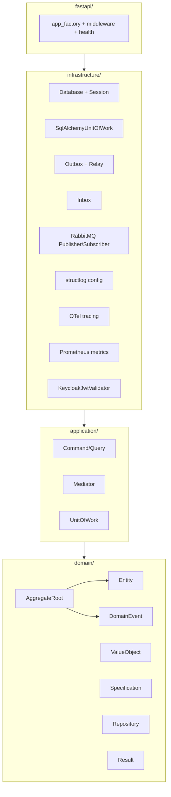
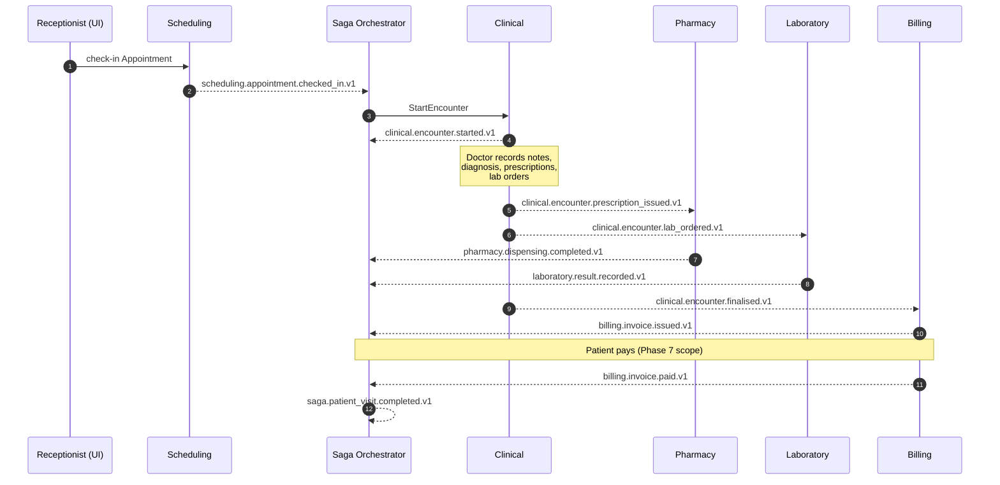
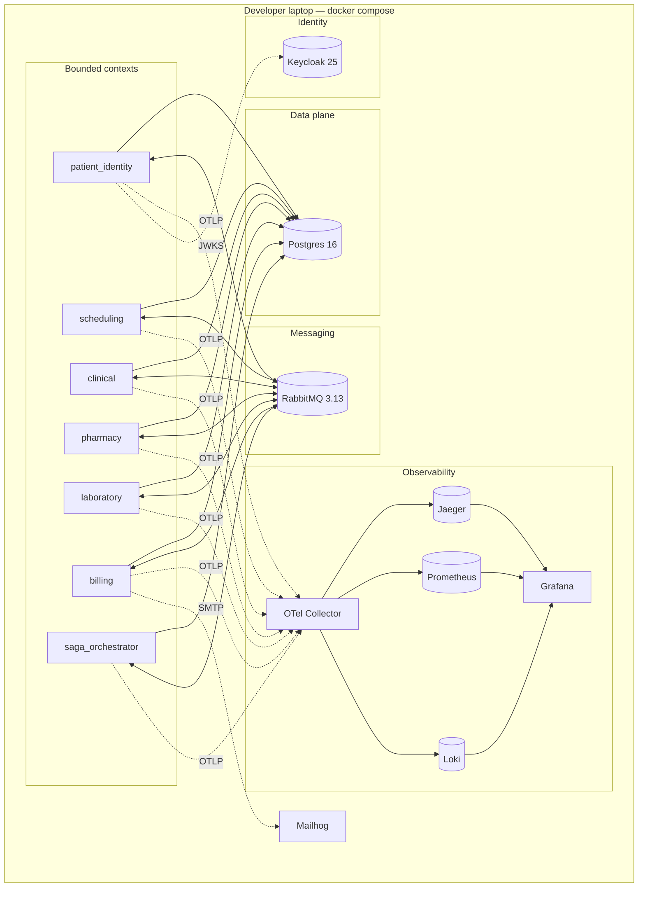

# SmartClinic — Architecture (arc42)

> Structured per the arc42 template (sections 1–9). Mermaid diagrams
> render on GitHub. Cross-links point into the repo so every claim is
> verifiable against code.

---

## 1. Introduction and Goals

SmartClinic is a digital backbone for medium-sized private clinics in
Zimbabwe. It replaces paper files and disconnected point-solutions
with an integrated platform covering patient registration, scheduling,
clinical encounters, pharmacy dispensing, laboratory fulfilment and
billing.

### 1.1 Requirements overview

| # | Requirement                                                                                     |
|---|-------------------------------------------------------------------------------------------------|
| F1 | Register patients with validated demographic and contact data.                                 |
| F2 | Book, reschedule, cancel and check in appointments.                                            |
| F3 | Record clinical encounters with full, immutable history.                                       |
| F4 | Issue prescriptions and orders for laboratory tests during encounters.                         |
| F5 | Dispense prescriptions with automated decision support (allergy / interaction checks).         |
| F6 | Record laboratory results against orders, flagging abnormal values.                            |
| F7 | Produce a single consolidated invoice per visit (consultation + pharmacy + lab).               |
| F8 | Enforce role-based access control (receptionist / doctor / pharmacist / accounts / lab tech).  |

### 1.2 Quality goals

| Priority | Quality attribute    | Concrete, measurable scenario (full set in [docs/quality-attribute-scenarios.md](../quality-attribute-scenarios.md)) |
|----------|----------------------|-----------------------------------------------------------------------------------------------------------------------|
| 1        | **Integrity**        | Any retroactive edit to a clinical event is detectable by a `verify_chain` call in O(events) (ADR-0012).              |
| 2        | **Availability**     | Pharmacy remains usable while Clinical is down; the dispensing queue accumulates and drains when Clinical recovers.   |
| 3        | **Modifiability**    | Adding a new bounded context requires no change to existing contexts; it subscribes to the bus and runs.              |
| 4        | **Auditability**     | Who did what, when and why can be reconstructed from the event log of the affected aggregate alone.                   |
| 5        | **Observability**    | p95 per-request latency is visible per service in Grafana within 30 s of the request; logs are trace-correlated.      |

### 1.3 Stakeholders

| Role              | Interest                                                            |
|-------------------|---------------------------------------------------------------------|
| Clinic owner      | ROI, regulatory compliance, uptime.                                 |
| Doctor            | Fast, accurate encounter capture; clinical decision support.        |
| Receptionist      | Fast patient registration, appointment slotting.                    |
| Pharmacist        | Safe dispensing, interaction checks.                                |
| Accounts          | Timely, accurate invoices; reconciliation.                          |
| Patient           | Privacy of their data; fair billing.                                |
| Regulator (MOHCC) | POPIA-equivalent compliance, auditable records.                     |
| Dev team          | Sustainable codebase, CI green, low on-call burden.                 |

---

## 2. Architecture Constraints

| Kind             | Constraint                                                                                           |
|------------------|------------------------------------------------------------------------------------------------------|
| Regulatory       | POPIA-equivalent data handling; medical records are not hard-deletable (see ADR-0012 crypto-shred).  |
| Organisational   | Three-person team; architecture must be demoable end-to-end on a laptop.                             |
| Technical        | Python 3.12+/FastAPI back-end; Angular 20 front-end (Phase 3); PostgreSQL as the only RDBMS.         |
| Operational      | Full stack must run via `docker compose up`.                                                         |
| Academic         | Must demonstrate ES, CQRS, Saga, Specification, ACL, Shared Kernel, Published Language explicitly.   |

---

## 3. Context and Scope

### 3.1 Business context

```mermaid
flowchart LR
    Patient([Patient])
    Doctor([Doctor])
    Pharmacist([Pharmacist])
    LabTech([Lab Tech])
    Receptionist([Receptionist])
    Accounts([Accounts])

    subgraph SmartClinic[SmartClinic Platform]
      UI[Angular Web UI]
      Services[6 Bounded-Context<br/>Services]
      Saga[Saga Orchestrator]
    end

    RxNav[(RxNav<br/>drug DB)]
    Email[(Email — MailHog)]
    IdP[(Keycloak IdP)]

    Patient  -->|registers, consults| UI
    Doctor   -->|uses| UI
    Pharmacist -->|uses| UI
    LabTech  -->|uses| UI
    Receptionist -->|uses| UI
    Accounts -->|uses| UI

    UI <-->|HTTPS/JSON,<br/>OIDC PKCE| Services
    Services <-->|topic bus +<br/>saga| Saga
    Services <-->|OIDC| IdP
    Services -.->|ACL (HTTPS)| RxNav
    Services -.->|SMTP| Email
```

### 3.2 Technical context

| Interface                                 | Protocol                        | Direction | Notes                                                         |
|-------------------------------------------|---------------------------------|-----------|---------------------------------------------------------------|
| User → UI                                 | HTTPS                           | in        | Angular SPA.                                                  |
| UI → API                                  | HTTPS + Bearer JWT              | in/out    | OIDC code flow + PKCE (public client).                        |
| Service ↔ Service                         | AMQP 0-9-1 (RabbitMQ)           | in/out    | Domain events only; no sync RPC between contexts.             |
| Service ↔ Postgres                        | TCP, SQL                        | in/out    | One DB per context.                                           |
| Service → OpenTelemetry Collector         | OTLP gRPC                       | out       | Traces, metrics, logs.                                        |
| Pharmacy → RxNav                          | HTTPS / JSON                    | out       | Behind an ACL (ADR-0007).                                     |
| Services → MailHog                        | SMTP                            | out       | Invoice / reminder emails.                                    |
| Services → Keycloak                       | HTTPS (JWKS)                    | out       | Offline token validation, cached TTL.                         |

---

## 4. Solution Strategy

| Goal                               | Chosen strategy                                                                     | ADR             |
|------------------------------------|-------------------------------------------------------------------------------------|-----------------|
| Isolate domain languages           | **Bounded contexts as microservices** on a topic bus.                               | ADR-0002        |
| Track medical history faithfully   | **Event Sourcing** in the Clinical context.                                         | ADR-0003        |
| Serve asymmetric reads             | **CQRS** in Clinical and Billing — separate read model.                             | ADR-0004        |
| Coordinate cross-context workflows | **Saga / Process Manager** for the Patient Visit.                                   | ADR-0005        |
| Encode complex rules               | **Specification Pattern** for dispensing decisions.                                 | ADR-0006        |
| Shield from upstream drift         | **Anti-Corruption Layer** around RxNav.                                             | ADR-0007        |
| Reliable event publication         | **Transactional Outbox + Inbox** in the Shared Kernel.                              | ADR-0009        |
| Consistent cross-cutting concerns  | **Narrow, governed Shared Kernel** (domain + types + infra primitives).             | ADR-0010        |
| Authenticate and authorise         | **Keycloak OIDC**; realm roles; shared JWT validator.                               | ADR-0011        |
| Prove integrity of the EMR         | **Hash-chained tamper-evident event store** (innovation).                           | ADR-0012        |

---

## 5. Building Block View

### 5.1 Level 1 — Context map (whitebox scope of the system)

See [docs/context-map.md](../context-map.md) for the full rendering
with edge labels.

### 5.2 Level 2 — Shared Kernel (whitebox of `libs/shared_kernel`)



The arrows encode the **import direction**: inward only. The CI
fitness functions enforce the same rule — see
[libs/shared_kernel/tests/fitness/test_architecture.py](../../libs/shared_kernel/tests/fitness/test_architecture.py).

### 5.3 Level 2 — A single bounded-context service (template)

```mermaid
flowchart TB
    subgraph api[api/  (HTTP)]
      R1[routers]
      E1[exception_handlers]
    end
    subgraph appl[application/]
      H1[command handlers]
      Q1[query handlers]
    end
    subgraph dom[domain/]
      Ag[Aggregate]
      Ev[Events]
      Sp[Specifications]
      Rp[Repository Protocol]
    end
    subgraph inf[infrastructure/]
      Pg[Postgres repository impl]
      Pub[Event publisher]
      Sub[Event subscribers]
    end

    api --> appl --> dom
    inf --> dom
    appl --> inf
```

---

## 6. Runtime View — The Patient Visit



Every arrow crossing a context boundary is a domain event on the
topic bus, published via the outbox (ADR-0009).

---

## 7. Deployment View



See [docker-compose.yml](../../docker-compose.yml) for the concrete
healthchecks, volumes, and the `full` profile that controls whether
the bounded-context services are started alongside the infrastructure.

---

## 8. Crosscutting Concepts

| Concept                  | Where it lives in the Shared Kernel                                                                 | ADR     |
|--------------------------|-----------------------------------------------------------------------------------------------------|---------|
| Domain primitives        | `shared_kernel.domain.*`                                                                            | —       |
| Value objects            | `shared_kernel.types.*` (money, national ID, email, phone, person name, clock, typed IDs)           | —       |
| Unit of Work + Outbox    | `shared_kernel.infrastructure.sqlalchemy_uow`, `infrastructure.outbox`                              | 0009    |
| Inbox / idempotency      | `shared_kernel.infrastructure.inbox`                                                                | 0009    |
| Event Bus                | `shared_kernel.infrastructure.event_bus` (aio-pika)                                                 | 0008    |
| Structured logging       | `shared_kernel.infrastructure.logging` (structlog JSON; trace-ID & correlation-ID injected)         | —       |
| Distributed tracing      | `shared_kernel.infrastructure.tracing` (OTLP gRPC)                                                  | —       |
| Metrics                  | `shared_kernel.infrastructure.metrics` (`prometheus-client`)                                        | —       |
| HTTP problem responses   | `shared_kernel.fastapi.exception_handlers` (RFC 7807 `application/problem+json`)                    | —       |
| Authentication           | `shared_kernel.infrastructure.security.KeycloakJwtValidator` + `fastapi.dependencies`               | 0011    |
| Correlation propagation  | `shared_kernel.infrastructure.correlation` (ContextVars, bridged into OTel baggage and structlog)   | —       |
| Health / readiness       | `shared_kernel.fastapi.health` (liveness + deep-readiness including DB + broker)                    | —       |

### 8.1 Error semantics

Every domain operation returns either success or a `DomainError`
subclass. The FastAPI exception handler maps each subclass to an
RFC 7807 `application/problem+json` response:

| Error                  | HTTP | Reason                                    |
|------------------------|------|-------------------------------------------|
| `NotFound`             | 404  | Aggregate not found by id.                |
| `InvariantViolation`   | 422  | Input respects schema, violates invariant.|
| `PreconditionFailed`   | 409  | State precondition not met.               |
| `ConcurrencyConflict`  | 409  | Optimistic-lock mismatch on aggregate.    |
| `Forbidden`            | 403  | Role-based denial.                        |
| `DomainError` (base)   | 400  | Other domain refusals.                    |

### 8.2 Consistency

**Strong** within a bounded context (Postgres transaction).
**Eventual** across bounded contexts — with the outbox+inbox pattern
providing *at-least-once* delivery and *exactly-once effect*
(ADR-0009).

### 8.3 Observability

Traces (OTel), metrics (Prometheus), logs (structlog → OTel → Loki)
are **correlated**: every log line carries `trace_id`, every
outbox→publish span carries `causation_id` and `correlation_id`, and
Grafana links between Loki lines and Jaeger spans automatically. See
[ops/grafana/provisioning/datasources/datasources.yml](../../ops/grafana/provisioning/datasources/datasources.yml).

### 8.4 Security

- OIDC bearer tokens on every endpoint (ADR-0011).
- Roles from `realm_access.roles`; FastAPI dependency
  `require_role("doctor")` per handler.
- PII is confined to Patient Identity; other contexts hold only
  references and minimal demographic copies.
- Audit: every state-changing event carries `actor_id` in headers.
- Secrets via environment variables; real deployments would pull
  from Vault. Dev defaults are sentinel values (documented in
  `.env.example`).
- Transport is HTTPS in production; localhost HTTP for the demo.

---

## 9. Architecture Decisions

See [docs/adr/](../adr/) for the full record. Twelve ADRs are in
place; every major design choice is traceable there.

## Glossary

Ubiquitous terms per context are documented in
[docs/ubiquitous-language.md](../ubiquitous-language.md).
