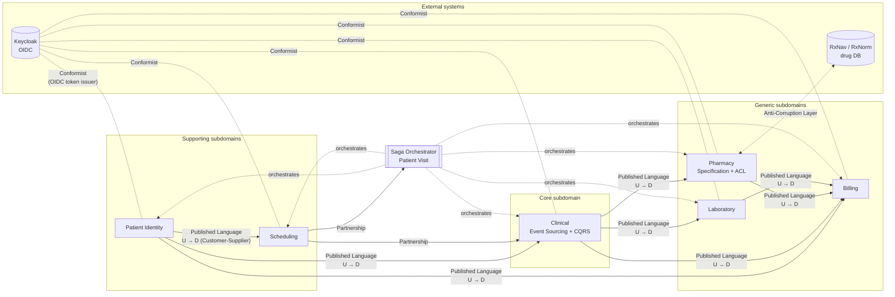

# SmartClinic — Context Map

> A context map names the bounded contexts and labels the
> **relationship type** on every edge between them. In DDD the
> relationship type matters more than the arrow: it tells you who is
> upstream (`U`) vs downstream (`D`), whether integration is via a
> Published Language, whether there is an Anti-Corruption Layer, and
> so on.

## Contexts at a glance

## Relationship types (definitions, for quick reference)

| Type                   | Meaning                                                                                   |
|------------------------|-------------------------------------------------------------------------------------------|
| Partnership            | Two contexts must change together; joint planning for integration points.                 |
| Customer-Supplier (U/D)| Upstream team publishes; downstream's needs influence upstream's backlog.                 |
| Conformist             | Downstream adopts upstream's model as-is (no influence).                                  |
| Anti-Corruption Layer  | Downstream translates upstream's model at the boundary into its own language.             |
| Shared Kernel          | Two+ contexts share a small, jointly-owned subset of the model.                           |
| Published Language     | Shared, well-documented communication format (our topic exchange + `*.v<N>` events).      |
| Open Host Service      | Published protocol (HTTP + OIDC) offered to any downstream.                               |

## Edges — why each relationship was chosen

### Patient Identity → Scheduling, Clinical, Billing (Customer-Supplier via Published Language)
Patient Identity is the **upstream system of record**. The downstream
contexts need a local, eventually-consistent read-model of patients
to validate `PatientId`s and show demographic data. They subscribe to
`patient.*` events and build their own materialised view. They never
write back.

### Scheduling ↔ Clinical (Partnership)
A check-in must become an encounter. Scheduling publishes
`scheduling.appointment.checked_in.v1`; Clinical starts an encounter.
Both teams evolve the payload together — classical Partnership.

### Clinical → Pharmacy, Laboratory, Billing (Customer-Supplier)
The core domain emits the actions that the others fulfil:
prescription → dispensing; lab order → result; finalised encounter →
invoice. Clinical publishes in its own language; downstream
translates if needed.

### Pharmacy → Billing, Laboratory → Billing (Customer-Supplier)
Dispensing and lab results are additional line-items on the final
invoice. Billing subscribes to `pharmacy.dispensing.completed.v1` and
`laboratory.result.recorded.v1`.

### Pharmacy ↔ RxNav (Anti-Corruption Layer)
RxNav is US-centric and uses its own vocabulary (`rxcui`, `tty`). We
translate at the boundary (ADR-0007). This also means the upstream
can be swapped (e.g., for a Zimbabwean MOHCC formulary) without
touching Pharmacy's domain model.

### Keycloak → every context (Conformist)
Every service validates tokens per RFC 7515/7519 and extracts roles
per Keycloak's claim shape. We do not influence Keycloak's model; we
conform to it. (ADR-0011.)

### Saga Orchestrator ↔ everyone (orchestration, not a DDD edge)
The saga is a **Process Manager**: it listens to events from every
context and issues commands / compensations. It does not own domain
data, only workflow state. (ADR-0005.)

## Core vs Supporting vs Generic

The shape above is grouped by **subdomain type** (Evans, ch. 15):

- **Core** (differentiating, complex, worth the engineering spend):
  **Clinical**. This is where the EMR, Event Sourcing, CQRS, and
  the hash-chained event store live.
- **Supporting** (necessary but not differentiating):
  **Patient Identity**, **Scheduling**.
- **Generic** (reusable, commodity, could be bought or swapped):
  **Pharmacy** (ACL means we could use any formulary),
  **Laboratory**, **Billing**.

This classification drives where we spend architectural capital:
rich, fully-fledged domain models in Clinical; minimal, direct
models in the supporting/generic contexts.

## Impact on the code

The context map above maps directly to the repository layout:
`services/<context>` per node, `libs/shared_kernel` for the
jointly-owned subset, `ops/rabbitmq/definitions.json` for the
Published Language plumbing (topic exchange + routing keys). The
fitness function
[libs/shared_kernel/tests/fitness/test_architecture.py](../libs/shared_kernel/tests/fitness/test_architecture.py)
asserts no cross-context imports exist — the map is not aspirational,
it is enforced.
