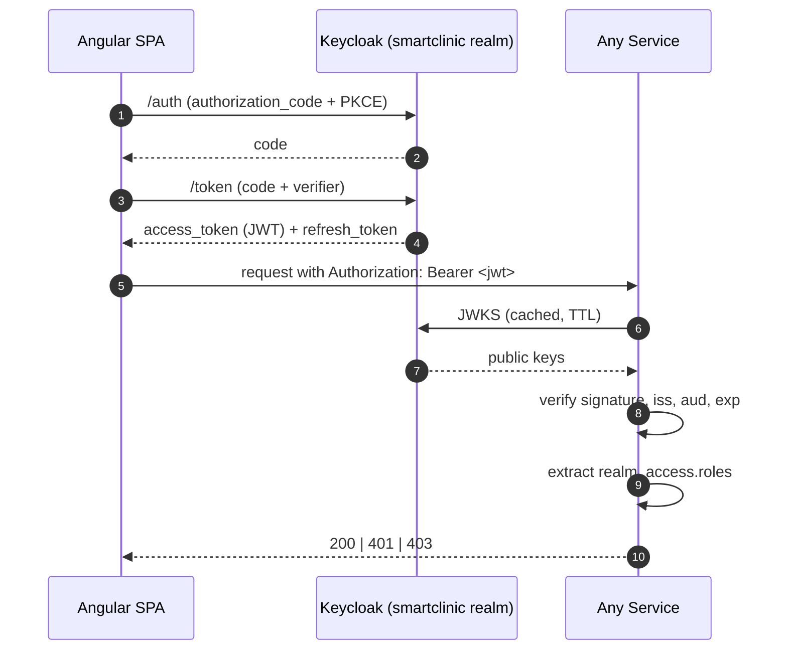

# SmartClinic — Security and Compliance

> Clinical data is among the most sensitive data any system handles.
> This document lays out the threat model, the compliance posture,
> and the controls that answer both. Think of it as the "defensive"
> counterpart to the quality-attribute scenarios.

## 1. Regulatory frame

Zimbabwe's **Cyber and Data Protection Act (Ch. 11:22, 2021)** ("the
Act") is the operative data-protection law. Its provisions materially
align with the South African POPIA and, more distantly, HIPAA. The
Act mandates: lawful basis for processing, data minimisation,
purpose limitation, storage security, subject rights (access,
rectification, erasure, objection), breach notification, and
cross-border transfer controls.

SmartClinic's design commitments map to the Act as follows:

| Principle (Act)                                 | Design response                                                                                                        |
|-------------------------------------------------|------------------------------------------------------------------------------------------------------------------------|
| Lawful basis & consent                          | Consent is a first-class aggregate in Patient Identity (grant / revoke events); no processing proceeds without it.     |
| Purpose limitation                              | Bounded contexts hold only the minimum data for their purpose (ADR-0002). Patient Identity is the only full PII home.  |
| Data minimisation                               | Downstream contexts keep narrow read-models (PatientId + display name + relevant demographics), not full profiles.     |
| Accuracy                                        | Patient Identity events are append-only; "corrections" are explicit events, preserving history.                        |
| Security of processing                          | OIDC (ADR-0011); encrypted transport (HTTPS in prod); hash-chained clinical events (ADR-0012).                         |
| Right to erasure                                | Crypto-shredding on the Clinical event store (ADR-0012); `patient.consent_revoked.v1` triggers projection erasure.     |
| Auditability / breach detection                 | Event logs per aggregate + hash chain on Clinical + tamper detection in O(events).                                     |
| Cross-border transfer                           | Out of scope for the local demo; deployment guide (Phase 9) will address.                                              |

## 2. STRIDE threat model

Applied per bounded context. `~` denotes low residual risk given the
listed controls; `!` denotes a known residual concern carried into
the risk register.

### 2.1 All contexts (baseline)

| Threat                          | Vector                                        | Control                                                                                                     | Residual |
|---------------------------------|-----------------------------------------------|-------------------------------------------------------------------------------------------------------------|----------|
| **S**poofing (caller identity)  | Stolen / forged token                         | OIDC + JWKS signature verification (ADR-0011); `aud` and `iss` pinning; short token lifespan (15 min).      | ~        |
| **T**ampering (in transit)      | MITM on API                                   | HTTPS in production; no cleartext tokens.                                                                   | ~        |
| **T**ampering (at rest)         | DB admin edits data                           | Clinical: hash chain (ADR-0012). Others: audit via event log on change; DB roles limit direct writes.       | !        |
| **R**epudiation                 | Actor denies action                           | Every event carries `actor_id` and `trace_id`; immutable event history.                                     | ~        |
| **I**nformation disclosure      | Log leaking PII                               | `structlog` processors redact known-sensitive keys (`password`, `token`, `national_id`) before JSON render. | ~        |
| **D**enial of service           | Message flood                                 | RabbitMQ queue TTL + max-length policy (see `ops/rabbitmq/definitions.json`); per-consumer prefetch.        | ~        |
| **E**levation of privilege      | Missing / loose role check                    | FastAPI dependency `require_role` per handler; fitness tests fail if a mutating handler lacks role guard (Phase 4+). | ~        |

### 2.2 Patient Identity (specific)

- **IDOR**: fetching another patient's data via guessing the id.
  Mitigated by an explicit "access scope" check in the query handler
  — a doctor sees only patients with an active or past appointment
  with them, enforced per query (Phase 2 scope, design here).

### 2.3 Clinical (specific)

- **Retroactive record edit** — the flagship threat in this domain.
  Mitigated by the hash chain (ADR-0012). Residual !: an attacker
  with *application-level* write access could append a falsified
  event at the head. Out-of-band anchoring (publishing the head hash
  daily) limits the window.
- **Mass extraction** — a service account with broad read access
  pulls the whole event log. Mitigated by scoped Postgres roles
  (`clinical` role can only read its own DB) and by keeping the event
  bus as the only public surface.

### 2.4 Pharmacy (specific)

- **External dependency poisoning** — RxNav returns malicious data.
  Mitigated by the ACL (ADR-0007): values cross the boundary
  only through a validating translator. An unexpected shape fails
  closed.
- **Over-dispensing** — a replayed `prescription_issued.v1` triggers
  duplicate dispensing. Mitigated by the Inbox (ADR-0009): each event
  processed at-most-once per consumer.

### 2.5 Billing (specific)

- **Price manipulation** — a tampered `pharmacy.dispensing.completed.v1`
  sets a favourable price. Mitigated by authority: prices are
  computed in Billing from its own tariff table, not taken from the
  upstream event.

## 3. AuthN / AuthZ details

### 3.1 Token flow

### 3.2 Role → permission matrix

| Action                                         | Required role(s)                                |
|------------------------------------------------|-------------------------------------------------|
| Register patient                               | `receptionist`                                  |
| Update demographics                            | `receptionist`, `doctor`                        |
| Book / reschedule / cancel appointment         | `receptionist`                                  |
| Check in / no-show appointment                 | `receptionist`                                  |
| Start / finalise encounter                     | `doctor`                                        |
| Record clinical note, diagnosis, vitals        | `doctor`                                        |
| Issue prescription / lab order                 | `doctor`                                        |
| Dispense / reject prescription                 | `pharmacist`                                    |
| Record lab result / amendment                  | `lab_technician`                                |
| View invoice                                   | `accounts`, `doctor`                            |
| Record payment                                 | `accounts`                                      |

(Phase 4+ will implement each of these as a concrete FastAPI
dependency attached to the relevant route.)

## 4. PII handling rules

1. **Location**: full PII lives only in the Patient Identity database.
2. **Projections**: downstream contexts hold minimal copies — Patient
   Name, Date-of-Birth, preferred contact — updated by subscribing
   to `patient.*`. Never the National ID.
3. **Logs**: structlog has a PII redaction processor that hashes or
   drops fields whose names match a curated deny-list. See
   `shared_kernel.infrastructure.logging` (Phase 1).
4. **Traces**: OTel span attributes are filtered to avoid capturing
   body payloads. Only IDs travel into spans.
5. **Metrics**: label cardinality is bounded (no patient IDs as
   labels); metrics are aggregate-only by policy.

## 5. Incident & breach response outline

| Stage          | Action                                                                                                                  |
|----------------|-------------------------------------------------------------------------------------------------------------------------|
| Detection      | Alerts from Prometheus (error rate, auth failure spike, outbox lag); anomalies from `verify_chain` failing.             |
| Containment    | Rotate Keycloak client secret; revoke refresh tokens via Keycloak admin; disable affected account.                      |
| Eradication    | Find the trace / event that introduced the anomaly via Jaeger+Loki; fix underlying defect.                              |
| Recovery       | Restore projections from events; re-issue tokens.                                                                       |
| Notification   | Within 72 h per the Act: Data Protection Authority + affected data subjects, with nature, scope and remediation steps.  |
| Post-mortem    | Blameless; update this document and add an ADR if architectural change follows.                                         |

## 6. Secrets management

- Development: `.env.example` documents every secret; real secrets
  kept out of the repo.
- Production: pulled from a secrets manager (Vault, AWS Secrets
  Manager, GCP Secret Manager) at startup; never materialised in the
  image.
- CI: short-lived credentials injected by the runner; hygiene
  enforced by `detect-secrets` pre-commit hook.

## 7. What is out of scope for Phase 1

- Rate limiting at the API edge (Phase 3 — API gateway decision).
- Field-level encryption for at-rest PII (Phase 2 — requires concrete
  threat model for the specific deployment).
- Formal DPIA documentation (Phase 9 — deployment-specific).

These are not omissions; they are sequenced for when they can be done
meaningfully, not ritualistically.
